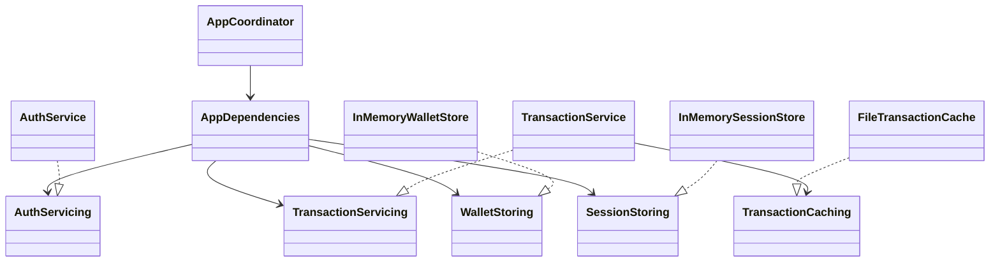
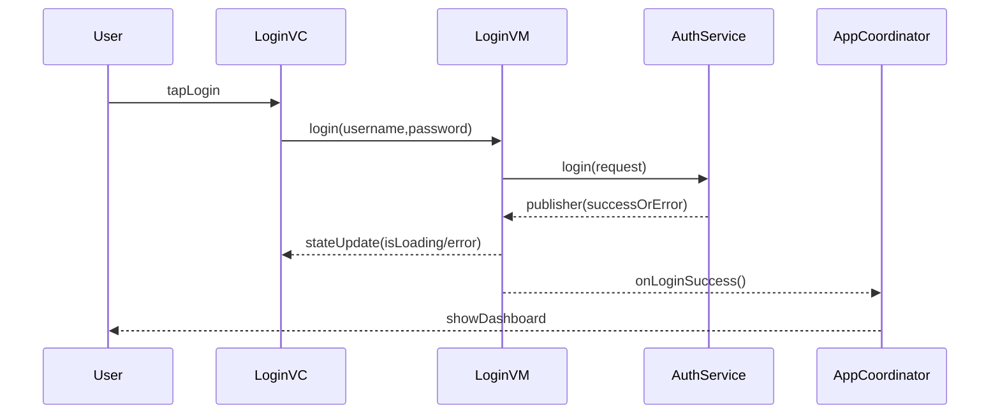
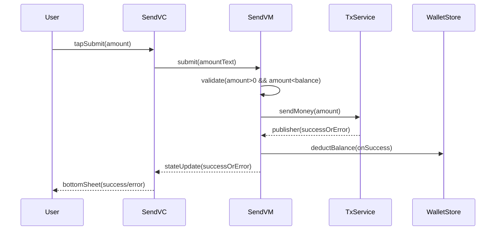

# Design documentation

## High-level structure
- **Coordinator**: owns navigation and composes view controllers.
- **Scene**: `UIViewController` + `ViewModel` (MVVM).
- **Services**: `AuthServicing`, `TransactionServicing` abstractions for testability.
- **Stores**: in-memory session + wallet balance.
- **Cache (bonus)**: local disk cache for transactions.

## Class diagram (simplified)

## Sequence: login

## Sequence: send money

